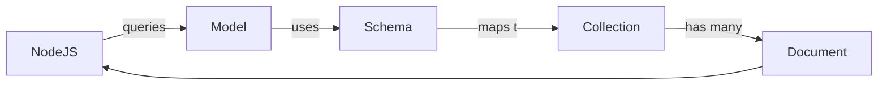

# Laniakea Project

> Started April 2, 2022 - evjero

Project created in order to expand knowledge of bridging the gap between frontend and backend engineering via **Node.js**. Allowing me to write both edges of the stack in the same language (TypeScript). Heavy processing and performance concerns is not as critical in this project. Uncomplex database access via MongoDB (Atlas) will also be used.

# Project Overview

This project, despite it's name, will use Exoplanet data captured by Kepler via their [TAP interface](https://exoplanetarchive.ipac.caltech.edu/docs/TAP/usingTAP.html#PS). These Kepler Objects of Interest (KOI) will be provided in a tabular (CSV) format and initially loaded into a Mongo database.

These KOI will enable us to launch our own missions to explore the edges of space.

## Tasks

-   [x] Node.js backend executable
-   [x] Express.js app with router/routes
-   [x] Define API type declarations
-   [x] Vite frontend executable
-   [x] React components/features (SPA)
-   [x] Redux Toolkit (RTK) state management
-   [x] MongoDB Cluster + mongoose integration
-   [x] Update route unit tests to include mock database
-   [x] Add SpaceX Historical data
-   [x] Github CI Actions (+husky)
-   [x] Tidy modules/imports
-   [x] Add comments for unclear code
-   [ ] Host on github.io or other

# Commands

`npm run install` - Installs dependencies for both client and server
`npm start` - Starts a development build of both the stateless server (Node.js + Express), stateful client (Vite + React), and document database (MongoDB)

# Appendix

## Node.js

> Node.js is "an asynchronous event-driven JavaScript runtime... designed to build scalable network applications. ...if there is no work to be done, Node.js will sleep" :bed: :zzz:

Node.js is very good at servers, networking (auth) and I/O. Unfortunately it is not good at leveraging GPU tasks like AI/ML or heavy CPU processing.

### Node.js vs Browser Runtimes

Browsers contain `window` but Node.js will contain [`global`](https://nodejs.org/dist/latest-v16.x/docs/api/globals.html). They each offer a variety of utility functions and variables, both of which are critical for developing nearly any program.

| `window`    | `global`       |
| ----------- | -------------- |
| _document_  | _process_      |
| _history_   | _module_       |
| _location_  | _\_\_filename_ |
| _navigator_ | _require()_    |

### Node.js Internals

Constructed on the backs of [v8](https://github.com/v8/v8) and [libuv](https://github.com/libuv/libuv) (C++), Node.js provides many useful modules, APIs, and automatic bindings for allowing programmatic access to operating system functions, like Async I/O for instance.

#### Threads

By default, there are 5 threads for a Node.js process. One `main`, which contains the event loop, and 4 auxiliary threads awaiting worker tasks. These threads are made available via _libuv_. However not all tasks are available to be run through the thread pool, and thus are sent to the OS kernel, like networking. Node.js automatically does the decision-making on the thread process.

#### Event Loop

While loops and callback queues (FIFO) are the bread and butter of operations within the Node.js process. These are virtually invisible to the day-to-day developer but key to the ordered phases below that are relevant to JavaScript.

1. Timers
    - `setTimeout` & `setInterval` operations
2. I/O callbacks
    - File system operations
    - Polling
3. `setImmediate`
    - "ASAP" invocation
4. Close callbacks

## MongoDB

There a few differences between a blob-friendly (file/document) style database vs a more traditional one with relational tables. Due to MongoDB's nature, we don't necessarily have to deal with the _object-relational impedance mismatch_ difficulties. MongoDB is written in JavaScript, and thus is an object-oriented language, not a relational language (like SQL), so a loose schema can be map objects together. By storing our data how it is stored in the code (arrays, collections, dictionaries) we can get around the RDBMS difficulties.

### MongoDB vs Postgres

|              | `MongoDB`   | `Postgres` |
| ------------ | ----------- | ---------- |
| Type         | Document    | Relational |
| Organization | Collections | Tables     |
| Language     | NoSQL       | SQL        |
| Scaling      | Horizontal  | Vertical   |
| Schema       | Flexible    | Rigid      |

### Depends on the data

Document-style databases are best used when data can be _unstructured_, or where the structure is not stable. Relational databases are best for when data structures are known and can be well-defined. Both can be modeled however.

It's important to look at _what is, or needs to be, stored_ in order to drive _how it should be stored_. Simple collections without many relations can use Document Databases.

We're going to use MongoDB since we only have simple collections in this project.

### Database Information

| Version | Region                           | Tier                 | Type                  | Backups  |
| ------- | -------------------------------- | -------------------- | --------------------- | -------- |
| 5.0.7   | Azure / Virginia-East2 (eastus2) | M0 Sandbox (General) | Replica Set - 3 nodes | Inactive |
