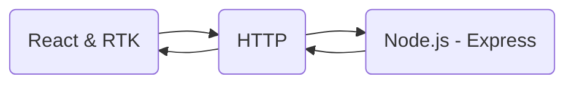
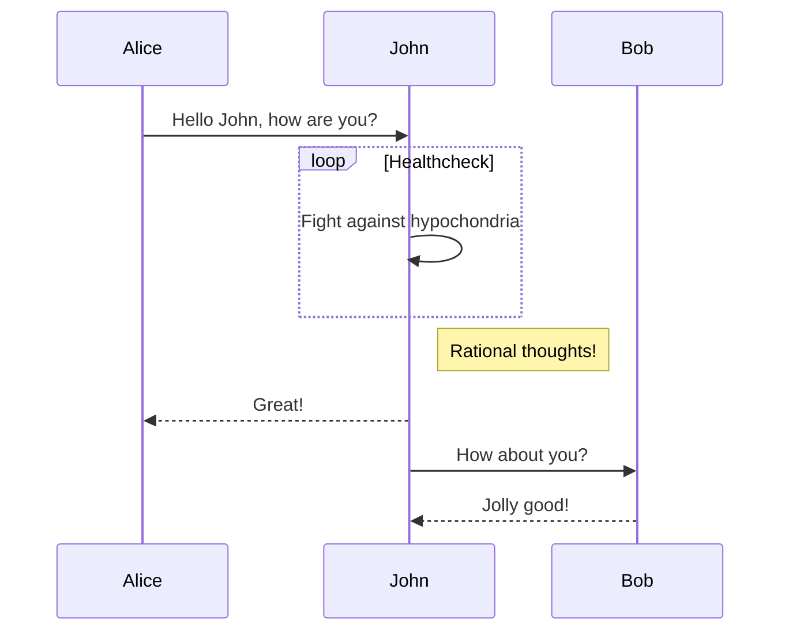

```mermaid
graph LR;
      App(React & RTK)-->Protocol(HTTP)-->API(Node.js - Express);
	  API-->Protocol-->App
```

```mermaid
sequenceDiagram
Alice->>John: Hello John, how are you?
loop Healthcheck
    John->>John: Fight against hypochondria
end
Note right of John: Rational thoughts!
John-->>Alice: Great!
John->>Bob: How about you?
Bob-->>John: Jolly good!
```
